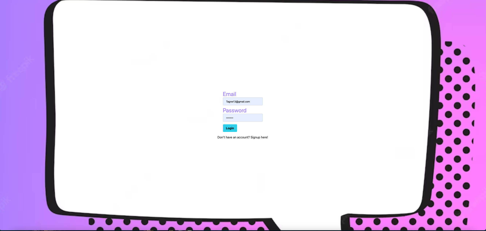

# ChatHub

  
    
  ## Table of Contents

  * [Description](#description)
  * [Installation](#installation)
  * [Usage](#usage)
  * [License](https://choosealicense.com/licenses/MIT)
  * [Contributing](#contributing)
  * [Tests](#tests)
  * [Questions](#questions)
  
  ## [Description](#table-of-contents)

  Create an account using the signup option. Once signed up you will be taken to the main conversation. If you already have an account, simply login to be taken to the chat. From here you can read previous messages or create and submit your own.

  ## [Installation](#table-of-contents)

  N/A

  ## [Usage](#table-of-contents)

  

  [Heroku Link Here](https://tagne13-chat-app-674e8ae58fd4.herokuapp.com/)

  ## [License](#table-of-contents)

  The application is covered under the following license:
    
  [MIT](https://choosealicense.com/licenses/MIT)
    
  ## [Contributing](#table-of-contents)

  Eric Partain, Eric Tranchell, Hank Richter, Jeff Montagne, and Trezz Tillman all contributed to the development of this project.

  Special contribution credited to Kartik Jevaji, TA in MSU Coding Bootcamp, for assistance with debugging and general guidance.

  ## [Tests](#table-of-contents)

  N/A

  ## [Questions](#table-of-contents)

  Please contact with questions using the following links:

  [Jeff Montagne](https://github.com/Tagne13), [Hank Richter](https://github.com/HankRichter), [Eric Tranchell](https://github.com/etranchell), [Trezz Tillman](https://github.com/TuddaT0224), [Eric Partain](https://github.com/KnightHawk1090)

  [Email: Tagne13@gmail.com](mailto:Tagne13@gmail.com), [hankrichter97@gmail.com](mailto:hankrichter97@gmail.com), [erictranchell@yahoo.com](mailto:erictranchell@yahoo.com), [Trezzt0224@gmail.com](mailto:Trezzt0224@gmail.com), [eric.partain@yahoo.com](mailto:eric.partain@yahoo.com)